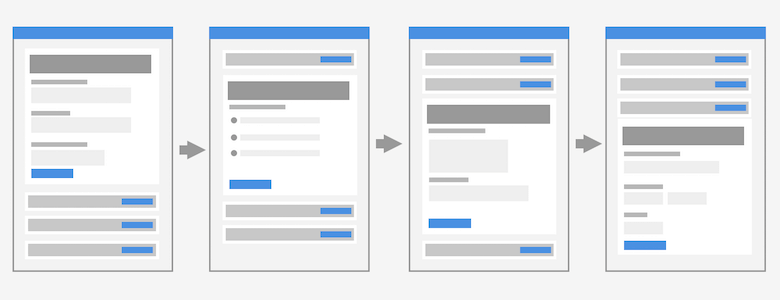

## Пошаговый ввод
Концепция подразумевает пошаговвый ввод требуемой информации, для подтверждения введенных данных требуется нажать на кнопку "продолжить".

## Основные шаги
* [Проверка содержимого заказа](order-list/) - работа с содержимым заказа
* [Данные получателя](user-info/) - ввод данных пользователя
	* [Покупка от частного лица](user-info/personal/)
	* [Покупка от организации](user-info/company/)
* [Способ получения](getting/) - выбор способа получения
	* [Доставка](getting/delivery/)
	* [Самовывоз](getting/pickup/)
* [Способ оплаты](payment/) - ввод данных пользователя

## Гипотезы
* One Thing Per Page → отделить корзину, разделить этапы на отдельные страницы 
