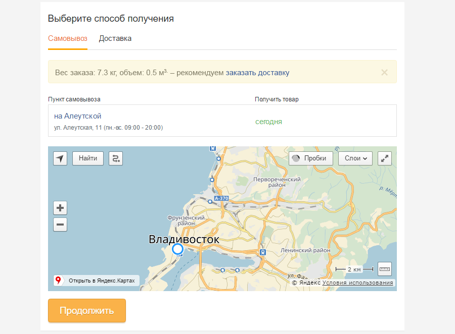
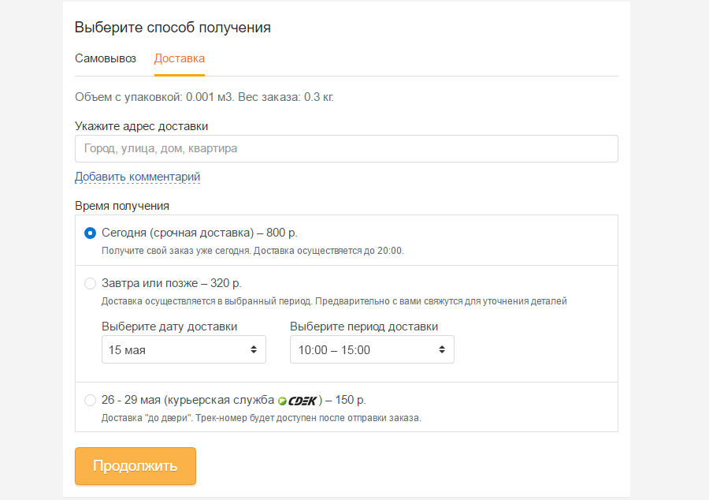

## Выбор способа получения

Выбор способа получения реализован при помощи табов, по умолчанию выбран самовывоз.
> При оформлении заказа на юридическое лицо доставка должна быть неактивна.

### Самовывоз

Выбрав способ получения самовывоз, клиент должен отметить нужный пункт получения заказа. Это можно сделать, выбрав нужную точку в списке магазинов или отметить на карте.
Данные отображаемые по точке получения:
* Название
* Адрес
* Время работы
* Статус готовности заказа

#### 1 магазин для самовывоза
Для городов с 1 точкой получения, список и карта совмещена.
Если мы находимся в терминале, скрываем карту.

#### Блок рекомендация доставки
Если вес заказа превышает Х кг, показываем блок с рекомендацией доставки. 

### Доставка

Для оформления доставки необходимо ввести адрес, а также выбрать подходящий способ доставки.
Некоторые способы доставки предполагают ввод дополнительных данных, таких как дата доставки и период доставки.

> Доставку "с завтрашнего дня" можно заказать на неделю вперед

При переходе на вкладку "доставка" запрашиваем координаты, на их основе подставляем адрес в соответствующее поле.

### Разделение заказа

> Дата доступности заказа  - максимальная дата доступности одного или нескольких товаров в заказе в указанном пункте самовывоза.
> Дата доступности части заказа -  дата доступности одного или нескольких товаров в заказе, отличающаяся от даты доступности заказа в меньшую сторону в указанном пункте самовывоза.

Дата доступности заказа всегда существует.

Заказ разбивается при наличии даты доступности части заказа в выбранном пункте самовывоза.

При выборе пункта самовывоза с разделением заказа, выводим уведомление