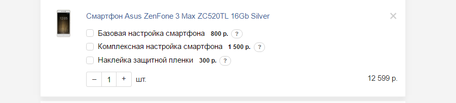

## Содержимое корзины

### Отображение единицы товара

#### Содержимое блока
* наименование (оно же ссылка на карточку товара);
* артикул;
* изображение (максимальная высота/ширина 60 пикс, но саму картинку можно взять, например, с категории, для получения приемлемого качества на моб устройствах);
* количество товара - счетчик (инкремент, декремент и числовое поле для ввода);
* цена за единицу  - показывается если больше 1;
* сумма по товару -  произведение количества и цены за единицу;
* ссылка на удаление (крестик).

### Работа с услугами

#### Содержимое блока
* чекбокс
* название услуги
* стоимость
* количество (наследуется от товара) показывается если больше 1
* описание - скрыто в popup. Описание содержит перечень работ, которые включает услуга, ее продолжительность и предупреждение.

#### Принцип работы
* добавление услуги в заказ осуществляется с помощью чекбокса
* стоимость оказания услуги добавляется к цене товара (в виде "1 услуга: 500 р."), сумма по товару при этом остается неизменной
* суммарная стоимость отображается в блоке итоговой стоимости заказа

### Работа с количеством

#### Содержимое блока
* кнопка инкремент, декремент
* числовое поле для ввода

#### Принцип работы
* при увеличении количества отображается цена за ед. товара, сумма по товару, которая рассчитывается по формуле кол-во * цена за ед. 
* количество влияет на стоимость оказания услуги, стоимость услуг учитывает количество 

### Отображение подарков

#### Содержимое блока
* стикер "бесплатный подарок"
* название подарка 
* пункты выдачи в которых подарок имеется в наличии 
* количество
* стоимость - бесплатно

### Отображение скидки по промокоду 

#### Содержимое блока
* изображение акции (максимальная высота/ширина 60 пикс, реальный размер 300*300);
* название акции в виде стикера
* фраза “Скидка по промокоду “ххх””
* размер выгоды со знаком “минус”
* ссылка на сброс промокода
* Итоговая стоимость заказа с учетом скидки