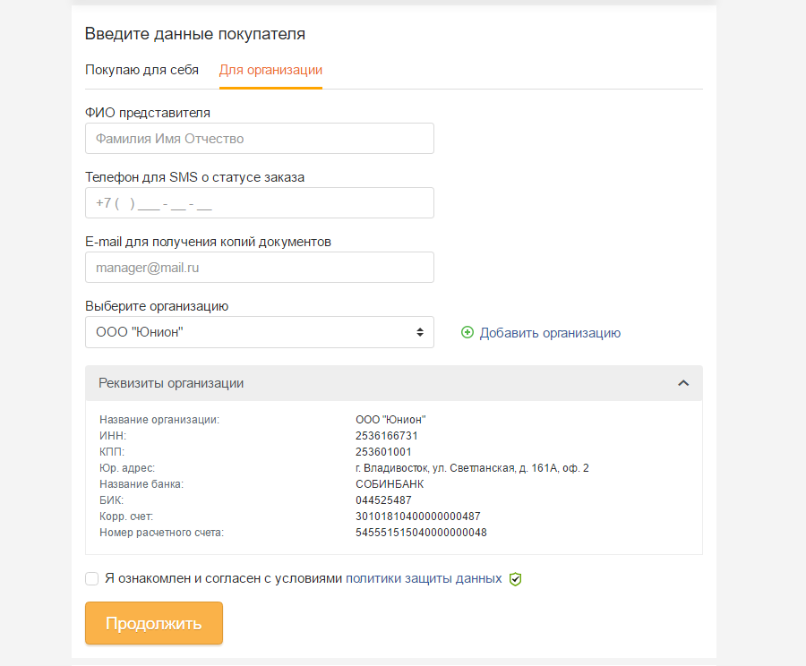

## Данные получателя

С помощью табов пользователю предлагается выбрать на кого будет оформлен заказ: на частное лицо или организацию.

### Покупка от частного лица

* Поле "ФИО для гарантийного талона" (реализовать “умный плэйсхолдер”) -обязательное
* Поле "Телефон для SMS о статусе заказа" (тип телефон) -обязательное, +маска
* Поле "E-mail для специальных предложений" (тип эмейл) - необязательное, скрывается на мобильных устройствах
* Чекбокс Количество бонусов при клике, если ФИО и телефон заполнены, открывается модал “Получить бонусы” .
* Чекбокс Политика защиты данных

### Организация

* Поле "ФИО представителя" -обязательное
* Поле "Телефон для SMS о статусе заказа" -обязательное
* Поле "E-mail для получения копий документов" -обязательное
* Селект "Выбор организации" - если авторизован и есть сохраненные организации, если организаций нет, селект не отображается.
* Ссылка на добавлении организации, открывает соответствующий модал
* Реквизиты организации, блок отображаемый при выборе организации из имеющегося списка, либо при добавлении новой организации
* Чекбокс- Политика защиты данных.

> Блок реквизиты организации показывается полько после выбоа в организации в соответствуюшем селекте. 

### Работа с бонусной программой

> В бонусной программе принимают участие только физические лица.

#### Активация бонусной карты

Для начисления бонусов покупателю необходимо активировать чекбокс "Получить до Х р. бонусов". Обязательные поля предшествующей формы (ФИО, телефон) должны быть заполнены. При активации чекбокса, открывается модальное, где пользователя просят ввести номер бонусной карты и фамилию (ранее уже заполнялось, подставляем значение).

> Номер бонусной карты должен соответствовать введённой фамилии, если это условие не выполняется, выводить сообщение о несовпадении фамилии и номера карты. 

При успешном вводе номера бонусной карты клиент отправляет данные формы, модальное окно закрывается. В блоке пользовательской информации чекбокс "Получить до Х р. бонусов" заменен, выводится:
* Баланс бонусной карты.
* Информацию о количестве начисляемых за заказ бонусов 

#### Заявка на участие в бонусной программе

Если у пользователя нет бонусной карты, он может разместить заявку на ее оформление, для этого в модальном окне "Применение бонусной карты"" нужно нажать на ссылку "Завести карту и получить бонусы". Откроется модальное окно "Анкета бонусного клиента"

После сохранения анкеты в блоке пользовательской информации чекбокс "Получить до Х р. бонусов" заменен, выводится: 
* Анкета бонусного клиента, где представлены данные заполненной анкеты, также имеется возможность изменить анкету и отказаться от нее.
* Информация о количестве начисляемых за заказ бонусов

